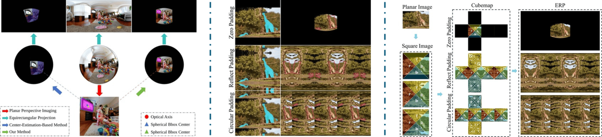
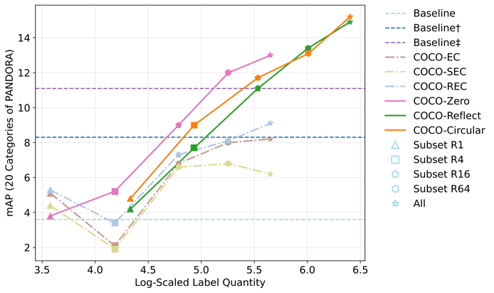

# <center> Enhance Panoramic Object Detection Using Planar Image Datasets</center>

<!-- [](https://ijcai-23.org/) -->
[](https://pytorch.org/)
[](https://github.com/open-mmlab/mmdetection/releases/tag/v3.1.0)
[](https://github.com/open-mmlab/mmrotate/tree/v1.0.0rc1)
[](https://github.com/longlong-yu/official-panorama-coco/blob/main/LICENSE)

## 🌀 Introduction

This repository contains the official implementation of the paper:

**Enhance Panoramic Object Detection Using Planar Image Datasets**  
<!-- _(Accepted to IEEE Transactions on Multimedia, 2025)_ -->

We propose a synthetic data generation and annotation framework that enables panoramic object detection using existing large-scale **planar image datasets**. Instead of relying solely on limited real-world panoramic data, we introduce a geometry-aware synthetic data generation framework that transforms perspective images into realistic spherical panoramas with accurate annotations.

<p align="center">
    
</p>


---

## 🔍 Key Contributions

- We propose a geometry-aware synthesis framework that transforms standard 2D perspective images into realistic panoramic images, minimizing distortion by maintaining camera axis consistency during projection.

- We introduce an accurate spherical annotation method that converts object masks into bounding boxes on the sphere, avoiding errors from planar box approximations.

- We design a Cubemap Rotation Augmentation strategy that improves the robustness of panoramic detectors to ERP distortions and varying object locations.

- We build and release three synthetic datasets (COCO-Zero, COCO-Reflect, and COCO-Circular), as well as enhanced annotations for 360-Indoor+, significantly boosting training efficiency and performance.

- Extensive experiments on PANDORA and 360-Indoor+ demonstrate that our method consistently improves detection accuracy over state-of-the-art approaches.

---

## ✅ Updates
- (05/08/2025) All annotations, configuration files, logs, and pretrained models are now available! The full codebase will be made publicly available upon the acceptance of the paper.

---

## 🚀 Getting Started

```bash
git clone https://github.com/longlong-yu/official-panorama-coco.git
cd official-panorama-coco

conda create --name openmmlab python=3.8 -y
conda activate openmmlab

conda install pytorch==1.12.1 torchvision==0.13.1 torchaudio==0.12.1 cudatoolkit=11.3 -c pytorch

pip install -U openmim
mim install 'mmdet>=3.0.0rc2,<=3.1.0'
mim install mmrotate

pip install future tensorboard Pillow==9.5.0 pydantic numba
```

---

## 📦 Datasets

### Unified Annotation Format
To ensure consistency across different datasets and facilitate fair comparison, we adopt a unified annotation format for all datasets used in this work.

Specifically, we follow the RBFoV format proposed in [**Pandora: A panoramic detection dataset for object with orientation**](https://www.ecva.net/papers/eccv_2022/papers_ECCV/papers/136680229-supp.pdf), defined as: $(\theta, \phi, \alpha, \beta, \gamma)$, where:

- $\theta$ and $\phi$ indicate the latitude and longitude of the object center,

- $\alpha$ and $\beta$ denote the horizontal and vertical field-of-view angles,

- $\gamma$ represents the in-plane rotation angle of the object.

All annotations provided in this repository conform to this format.
In our experiments, we use the radian version of this format as input to the detection models.

***

### Synthetic Datasets Based on COCO

We construct three synthetic panoramic datasets using images and labels from the [**COCO**](https://cocodataset.org) dataset:

- **COCO-Zero**: simple ERP projection from original perspective images.

- **COCO-Reflect**: extended using reflect padding for contextual augmentation.

- **COCO-Circular**: extended using circular padding (shown to be most effective).

We provide:

- Scripts for generating synthetic images from COCO and computing spherical annotations.
```bash
scripts/tranform_panorama_dataset.sh

scripts/merge_anns.sh
```

- Precomputed annotation files ([**COCO-Zero**](https://github.com/longlong-yu/official-panorama-coco/releases/tag/v1.0.0-coco-zero), [**COCO-Reflect**](https://github.com/longlong-yu/official-panorama-coco/releases/tag/v1.0.0-coco-reflect), [**COCO-Circular**](https://github.com/longlong-yu/official-panorama-coco/releases/tag/v1.0.0-coco-circular)) in RBFoV format; corresponding images can be synthesized using the provided scripts.

***

### 360-Indoor & 360-Indoor+

We enhance the [**360-Indoor**](https://aliensunmin.github.io/project/360-dataset/) dataset using [**SAM**](https://github.com/facebookresearch/segment-anything)-generated masks and our annotation pipeline to produce 360-Indoor+, which includes rotation-aware, accurate spherical bounding boxes.

We provide:

- Unified RBFoV-format annotations for both [**360-Indoor**](https://github.com/longlong-yu/official-panorama-coco/releases/tag/v1.0.0-360-indoor) and [**360-Indoor+**](https://github.com/longlong-yu/official-panorama-coco/releases/tag/v1.0.0-360-indoor%2B).

***

### PANDORA
We validate the effectiveness of our method on the [**PANDORA**](https://github.com/tdsuper/SphericalObjectDetection) dataset.

---

## 🛠️  Model Training and Inference

Our method is implemented based on the [**MMDetection**](https://mmdetection.readthedocs.io/en/latest/) and [**MMRotate**](https://mmrotate.readthedocs.io/en/latest/) frameworks.
Training and inference are performed using the standard tools and interfaces provided by these toolkits, ensuring compatibility and ease of use. 

```bash
# CenterNet + PANDORA
python tools/train.py configs/sph_centernet/sph_centernet_r50_adamw-1x_pandora_fined.py

# CenterNet + 360-Indoor+
python tools/train.py configs/sph_centernet/sph_centernet_r50_adamw-1x_360indoor+_fined.py

# RetinaNet + PANDORA
python tools/train.py configs/sph_retinanet/sph_retinanet_50_fpn_sgd-1x_pandora_fined.py

# RetinaNet + 360-Indoor+
python tools/train.py configs/sph_retinanet/sph_retinanet_50_fpn_sgd-1x_360indoor+_fined.py

# Test model
python tools/test_model.py val_models  ${config file} ${model}
```

---

## 📈 Main Results

Our method demonstrates strong performance improvements on real-world benchmarks.  


| Model     | Pre-training Dataset |PANDORA (mAP)|360-Indoor+ (mAP)| Configs & Logs/Ckpts |
|:---------:|:--------------------:|:-----------:|:---------------:|:------------------:|
| RetinaNet | COCO-Zero            | 12.2        | 10.4            |[Config & Log](https://github.com/longlong-yu/official-panorama-coco/releases/tag/v1.0.0-configs-retinanet-coco-zero)/[Ckpt](https://github.com/longlong-yu/official-panorama-coco/releases/tag/v1.0.0-ckpt-retinanet-coco-zero)|
| RetinaNet | COCO-Reflect         | 12.9        | 10.9            |[Config & Log](https://github.com/longlong-yu/official-panorama-coco/releases/tag/v1.0.0-configs-retinanet-coco-reflect)/[Ckpt](https://github.com/longlong-yu/official-panorama-coco/releases/tag/v1.0.0-ckpt-retinanet-coco-reflect)|
| RetinaNet | COCO-Circular        | 12.8        | 11.2            |[Config & Log](https://github.com/longlong-yu/official-panorama-coco/releases/tag/v1.0.0-configs-retinanet-coco-circular)/[Ckpt](https://github.com/longlong-yu/official-panorama-coco/releases/tag/v1.0.0-ckpt-retinanet-coco-circular)|
| CenterNet | COCO-Zero            | 13.0        | 11.7            |[Config & Log](https://github.com/longlong-yu/official-panorama-coco/releases/tag/v1.0.0-configs-centernet-coco-zero)/[Ckpt](https://github.com/longlong-yu/official-panorama-coco/releases/tag/v1.0.0-ckpt-centernet-coco-zero)|
| CenterNet | COCO-Reflect         | 14.9        | 13.7            |[Config & Log](https://github.com/longlong-yu/official-panorama-coco/releases/tag/v1.0.0-configs-centernet-coco-reflect)/[Ckpt](https://github.com/longlong-yu/official-panorama-coco/releases/tag/v1.0.0-ckpt-centernet-coco-reflect)|
| CenterNet | COCO-Circular        | **15.2**    | **14.0**        |[Config & Log](https://github.com/longlong-yu/official-panorama-coco/releases/tag/v1.0.0-configs-centernet-coco-circular)/[Ckpt](https://github.com/longlong-yu/official-panorama-coco/releases/tag/v1.0.0-ckpt-centernet-coco-circular)|

The performance curves across different training subsets demonstrate that our method outperforms existing synthesis approaches.

<p align="center">
  
</p>

---

<!-- ## 📄 Citation

If you find this work helpful, please consider citing:

```bibtex
@article{your2025paper,
  title     = {Enhance Panoramic Object Detection Using Planar Image Datasets},
  author    = {Your Name and Coauthors},
  journal   = {IEEE Transactions on Multimedia},
  year      = {2025}
}
```

--- -->

## 📬 Contact

For questions or suggestions, please open an issue or contact us at: longlong.yu@hdu.edu.cn.

---

## 🙏 Acknowledgements

We implemented CenterNet based on the methods described in [**Pandora: A panoramic detection dataset for object with orientation**](https://www.ecva.net/papers/eccv_2022/papers_ECCV/papers/136680229-supp.pdf) and [**Unbiased iou for spherical image object detection**](https://ojs.aaai.org/index.php/AAAI/article/download/19929/19688), and RetinaNet following the approach proposed in [**Sph2Pob: Boosting Object Detection on Spherical Images with Planar Oriented Boxes Methods**](https://www.ijcai.org/proceedings/2023/0137.pdf).

We would like to especially thank [**Dr. Xinyuan Liu**](https://github.com/AntXinyuan) for providing the implementation code and offering valuable suggestions and support.

We also thank Dr. Shih-Han Chou for kindly providing access to the 360-Indoor dataset, which was essential for our experiments.

This project extends the open-source library [**equilib**](https://github.com/haruishi43/equilib) to support PyTorch-based cubemap-to-panorama conversion and panoramic image rotation.


